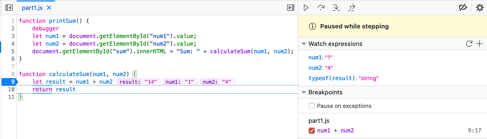
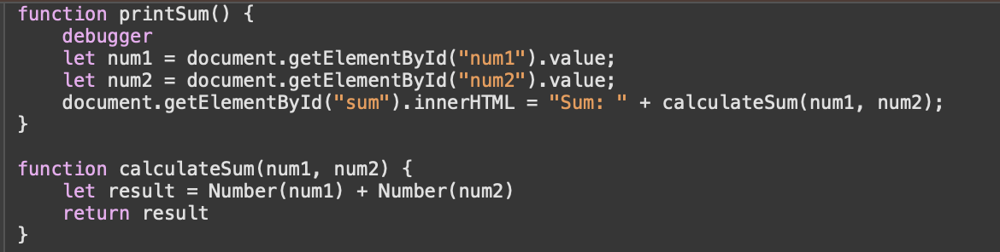

# Part 3 Responses

### DevTools - Debugging
#### Screenshots
Screenshot below shows code to the left and the breakpoints and watch expressions to the right.

#### Debugging 
The bug is that both "first number" and "second number" inputs are strings. When we hit this line `let result = num1 + num2`, the program tries to add the inputs. However, with the '+' operator, if a string is present, it does string concatenation. Rather than adding the numeric values of the first and second numbers, it concatenates them.

To fix this, we need to ensure that both inputs are converted to numbers so we do not do string concatenation. We can use function like `Number()` which converst a string to a number or `parseInt()` that converts to a whole number.

---

### DevTools - Network Tab
1. What is the name of the new json file? `citylots.json`
2. Which file initiated the download of the new file? `part2.js`
3. What is its file size? `11.1 MB`.
4. How long did it take to download? `0.8 ms`
5. What was your User-Agent for the browser that made the request? `Mozilla/5.0 (Macintosh; Intel Mac OS X 10.15; rv:84.0) Gecko/20100101 Firefox/84.0`
6. In the response, what type of server did it come from? `Apache`
7. When was the file last modified? `Tue, 26 Jan 2021 22:14:13 GMT`
8. What was the Content-Type of the file? `application/json`
9.  Which method inside the initiating file made the request? `fetchData()`
